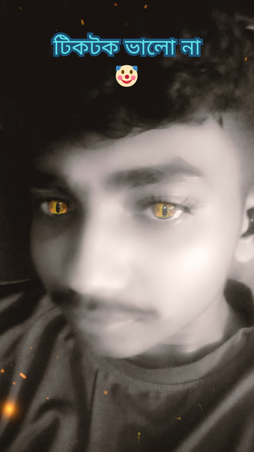

<!DOCTYPE html>
<html lang="bn">
<head>
    <meta charset="UTF-8">
    <meta name="viewport" content="width=device-width, initial-scale=1.0">
    <title>Friends Collection</title>
    
    <link rel="icon" type="image/jpeg" href="rrp.jpg">

    
</head>
<body>

    
🌙

    

        

            ধন্যবাদ আমাদের ওয়েবসাইটে আসার জন্য!  
            আমাদের ওয়েবসাইটটি কারো অপমান বা ছোট করার জন্য তৈরি করা হয়নি। এটি সম্পূর্ণভাবে মজা এবং বিনোদনের উদ্দেশ্যে তৈরি। তাই কেউ এই ওয়েবসাইটকে খারাপভাবে বা নেতিবাচকভাবে দেখবেন না। আমাদের উদ্দেশ্য শুধু হাসি, আনন্দ এবং ভালো সময় উপভোগ করা। ধন্যবাদ!
        

    

    <h1>Friends</h1>

    

        
        

            
            <audio id="audio1" loop><source src="meow-ghop-ghop-ghop.mp3" type="audio/mpeg"></audio>
            <button class="play-btn" onclick="playMusic('audio1', this)">▶ Play Music 1</button>
        

        

            
            <audio id="audio2" loop><source src="music2.mp3" type="audio/mpeg"></audio>
            <button class="play-btn" onclick="playMusic('audio2', this)">▶ Play Music 2</button>
        

        

            
            <audio id="audio3" loop><source src="tuibesijanos.mp3" type="audio/mpeg"></audio>
            <button class="play-btn" onclick="playMusic('audio3', this)">▶ Play Music 3</button>
        

        

            
            <audio id="audio4" loop><source src="asol.mp3" type="audio/mpeg"></audio>
            <button class="play-btn" onclick="playMusic('audio4', this)">▶ Play Music 4</button>
        

    

    
</body>
</html>
<!DOCTYPE html>
<html lang="bn">
<head>
    <meta charset="UTF-8">
    <meta name="viewport" content="width=device-width, initial-scale=1.0">
    <title>Friends Collection</title>
    <link rel="icon" type="image/jpeg" href="rrp.jpg">
    
</head>
<body>

    
🌙

    

        

            ধন্যবাদ আমাদের ওয়েবসাইটে আসার জন্য!  
            আমাদের ওয়েবসাইটটি কারো অপমান বা ছোট করার জন্য তৈরি করা হয়নি। এটি সম্পূর্ণভাবে মজা এবং বিনোদনের উদ্দেশ্যে তৈরি। তাই কেউ এই ওয়েবসাইটকে খারাপভাবে বা নেতিবাচকভাবে দেখবেন না। আমাদের উদ্দেশ্য শুধু হাসি, আনন্দ এবং ভালো সময় উপভোগ করা। ধন্যবাদ!
        

    

    <h1>Friends</h1>

    

        
        

            
            <audio id="audio1" loop><source src="meow-ghop-ghop-ghop.mp3" type="audio/mpeg"></audio>
            <button class="play-btn" onclick="playMusic('audio1', this)">▶ Play Music 1</button>
        

        

            
            <audio id="audio2" loop><source src="music2.mp3" type="audio/mpeg"></audio>
            <button class="play-btn" onclick="playMusic('audio2', this)">▶ Play Music 2</button>
        

        

            
            <audio id="audio3" loop><source src="tuibesijanos.mp3" type="audio/mpeg"></audio>
            <button class="play-btn" onclick="playMusic('audio3', this)">▶ Play Music 3</button>
        

        

            
            <audio id="audio4" loop><source src="asol.mp3" type="audio/mpeg"></audio>
            <button class="play-btn" onclick="playMusic('audio4', this)">▶ Play Music 4</button>
        

    

    
</body>
</html>
